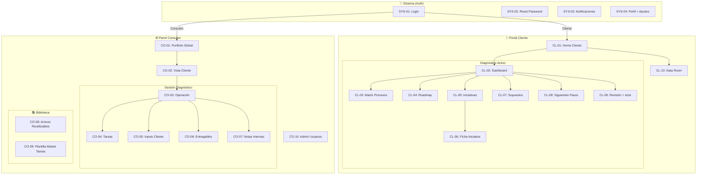

# 🗺️ Mapa de Navegación - Portal Diagnóstico V1

## Estructura General



---

## 📐 Navegación por Rol

### Cliente (Menú Lateral - Dentro de Diagnóstico)

| Orden | Ítem | Pantalla ID | Icono |
|-------|------|-------------|-------|
| 1 | Dashboard | CL-02 | 📊 |
| 2 | Matriz de Procesos | CL-03 | 📋 |
| 3 | Roadmap | CL-04 | 🗓️ |
| 4 | Iniciativas | CL-05 | 💡 |
| 5 | Supuestos/Medición | CL-07 | 📐 |
| 6 | Siguientes Pasos | CL-08 | ➡️ |
| 7 | Revisión + Acta | CL-09 | ✅ |
| 8 | Data Room | CL-10 | 📁 |

**Header Cliente:**
- Logo + Nombre Empresa
- Selector de diagnóstico (si tiene varios)
- 🔔 Notificaciones (badge con count)
- 👤 Perfil

---

### Consultor (Menú Lateral Global)

| Orden | Ítem | Pantalla ID | Icono |
|-------|------|-------------|-------|
| **Principal** ||||
| 1 | Portfolio | CO-01 | 📊 |
| 2 | Clientes | CO-02 | 👥 |
| **Biblioteca** ||||
| 3 | Activos Reutilizables | CO-08 | 📚 |
| 4 | Plantilla Tareas | CO-09 | 📝 |
| **Admin** ||||
| 5 | Usuarios | CO-10 | ⚙️ |

**Menú Contextual (dentro de un diagnóstico):**
| Orden | Ítem | Pantalla ID |
|-------|------|-------------|
| 1 | Operación | CO-03 |
| 2 | Tareas | CO-04 |
| 3 | Inputs Cliente | CO-05 |
| 4 | Entregables | CO-06 |
| 5 | Notas Internas | CO-07 |
| 6 | Data Room | CL-10* |

*El consultor accede al mismo Data Room que el cliente

---

## 🔄 Flujos de Usuario Críticos

### Flujo 1: Cliente accede a su diagnóstico
```
Login → Home Cliente → Seleccionar Diagnóstico → Dashboard → [Navegar secciones]
```

### Flujo 2: Consultor gestiona diagnóstico
```
Login → Portfolio → Filtrar por estado → Seleccionar diagnóstico → Operación → [Tareas/Inputs/Entregables]
```

### Flujo 3: Cliente sube datos (Data Room)
```
Home Cliente → Data Room → Seleccionar carpeta → Subir archivo → Confirmar
[Sistema: Notifica a consultor + actualiza checklist inputs]
```

### Flujo 4: Consultor publica entregable
```
Operación → Entregables → Crear/Editar → Cambiar a "Publicado"
[Sistema: Notifica a cliente]
```

### Flujo 5: Pausa por datos (48h)
```
[Automático: Si checklist datos mínimos incompleto tras 48h]
Estado diagnóstico → PAUSADO → Badge rojo visible para ambos roles
Consultor puede: "Reanudar reloj" manualmente
```

---

## 🏷️ Estados del Diagnóstico

| Estado | Color | Descripción |
|--------|-------|-------------|
| `BORRADOR` | Gris | Recién creado, no visible para cliente |
| `ONBOARDING` | Azul | Día 0, blindaje inicial |
| `EN_PROGRESO` | Violeta | Días 1-5, activo |
| `PAUSADO` | Rojo | Reloj detenido (falta datos 48h) |
| `REVISIÓN` | Naranja | Días 6-7, cierre |
| `ENTREGADO` | Verde | Completado, portal activo 60 días |
| `ARCHIVADO` | Gris oscuro | Pasados 60 días post-entrega |

---

## 📱 Responsive Breakpoints

| Breakpoint | Comportamiento |
|------------|----------------|
| Desktop (>1200px) | Sidebar expandido + contenido principal |
| Tablet (768-1200px) | Sidebar colapsable + contenido adaptado |
| Mobile (<768px) | Sidebar como drawer + navegación bottom |

> [!NOTE]
> Para V1, priorizar Desktop y Tablet. Mobile como "usable" pero no optimizado.
